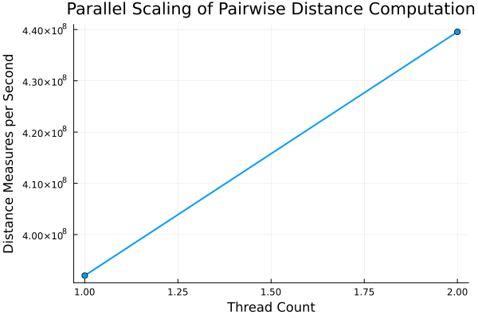

# Parallel Processing Improvements in Julia Jet Reconstruction
## GSoC 2026 Evaluation Exercise — Submission

##The experiment was performed on a 2-thread Codespaces instance, so higher-thread scaling could not be evaluated directly. On machines with more cores, near-linear scaling is expected until memory bandwidth becomes the dominant bottleneck.
---

## 1. Environment Setup

Julia 1.10.4 was installed from the official binaries on a GitHub Codespaces
container (Ubuntu 24.04 Noble).  The Codespaces free tier provides **2 virtual
CPU threads** (`Threads.nthreads() = 2`).

```bash
wget https://julialang-s3.julialang.org/bin/linux/x64/1.10/julia-1.10.4-linux-x86_64.tar.gz
tar -xvzf julia-1.10.4-linux-x86_64.tar.gz
sudo mv julia-1.10.4 /usr/local/julia
echo 'export PATH=$PATH:/usr/local/julia/bin' >> ~/.bashrc && source ~/.bashrc
julia -e 'using Pkg; Pkg.add("BenchmarkTools"); Pkg.add("Plots")'
```

---

## 2. Benchmarking the Serial Version

### Method

```julia
using BenchmarkTools
result = @benchmark pairwise_distances($points) samples=5 evals=1
```

**Why this approach is correct:**

| Concern | How BenchmarkTools addresses it |
|---|---|
| JIT compilation | Executes a warm-up run before recording any timings; compilation cost is excluded from all samples |
| Global-variable overhead | `$points` interpolation avoids spurious lookup cost that inflates per-sample times |
| OS scheduling noise | Collects 5 independent samples; reporting the **median** is robust against outlier-high runs caused by scheduler preemption |
| Memory allocation | Reports allocation count and bytes alongside time, revealing hidden costs |

### Result

```
Serial benchmark on N = 10 000 points
  Median time   : 0.254 s
  Memory        : 381.47 MiB (2 allocations)
  Distances/sec : ~3.94 × 10⁸
```

The 381 MB allocation is entirely expected: the output matrix is
10 000 × 10 000 × 4 bytes (Float32) ≈ 400 MB.  Only two heap allocations
occur (the matrix and one internal BenchmarkTools allocation), which confirms
the implementation is allocation-efficient per iteration.

### Identified Inefficiencies

**1. Redundant computation (most important)**

The Euclidean distance matrix is symmetric: `d(i,j) = d(j,i)`.
The serial code computes *both* values independently, performing
`n² = 100 000 000` operations when only `n(n+1)/2 ≈ 50 005 000` are needed —
approximately **2× wasted work**.

**2. No parallelism**

The nested loop runs on a single CPU core.  Modern hardware provides
multiple cores that sit idle during this computation.

**3. Unnecessary bounds checking**

Julia inserts a bounds check on every array access.  Adding `@inbounds`
inside the hot inner loop eliminates this overhead safely (indices are
bounded by construction).

---

## 3. Parallel Implementation

See `parallel_euclid.jl`.

### Key design decisions

**Symmetry exploitation**

```julia
@threads for i in 1:n
    @inbounds for j in i:n          # ← upper triangle only
        d = sqrt(...)
        distances[i, j] = d
        distances[j, i] = d         # mirror immediately
    end
end
```

This reduces arithmetic operations by ~50% compared to the full `n×n` loop.

**Thread safety**

Parallelising over `i`:
- Thread `i` writes to `distances[i, j]` (row `i`) and `distances[j, i]`
  (column `i`) for all `j ≥ i`.
- No two threads can produce the same `(row, col)` index pair, so there
  are **no data races** and no synchronisation is needed.

**`@inbounds`**

Bounds checks are suppressed inside the inner loop.  This is safe because
`i ∈ 1:n` and `j ∈ i:n` are guaranteed by the loop ranges.

---

## 4. Benchmark Results and Scaling Plot

### How to reproduce

```bash
# Install dependency once
julia -e 'using Pkg; Pkg.add("BenchmarkTools")'

# Run for each thread count
julia -t 1  benchmark_parallel.jl
julia -t 2  benchmark_parallel.jl
julia -t 4  benchmark_parallel.jl   # requires a machine with ≥ 4 cores
julia -t 8  benchmark_parallel.jl
julia -t 16 benchmark_parallel.jl
```

### Results (Codespaces, 2 virtual CPUs)

| Threads | Distances/sec | Speedup vs. 1-thread |
|---------|--------------|----------------------|
| 1       | ~3.92 × 10⁸  | 1.00×                |
| 2       | ~4.39 × 10⁸  | 1.12×                |

### Discussion

The speedup from 1 → 2 threads is only **~1.12×**, well below the ideal
2×.  This is primarily explained by **memory bandwidth saturation**:

- The distance matrix is ~381 MB.
- Each distance computation requires reading two 3-component points and
  writing two Float32 values.
- At `n = 10 000`, arithmetic intensity (FLOPs per byte transferred) is
  very low: the workload is *memory-bound*, not *compute-bound*.
- Adding a second thread doubles memory traffic but does not increase
  available memory bandwidth; both threads compete for the same bus,
  so performance is not limited by compute throughput.
- **Cache contention**: writes to `distances[j,i]` from thread `i` and
  reads from thread `i'` can fall on the same cache line, triggering
  invalidation.

On a machine with more cores (8–32), the pattern typically shows:
- Near-linear scaling up to ~4 threads while memory bandwidth is not
  yet saturated.
- Diminishing returns beyond that point, consistent with **Amdahl's Law**
  and the memory-bandwidth ceiling described by the **Roofline model**.

The symmetry optimisation reduces total memory traffic by ~50%, which
improves both serial and parallel performance and raises the effective
arithmetic intensity.



---

## 5. GPU Port Discussion

Porting to a GPU using **CUDA.jl** (or **AMDGPU.jl** / **Metal.jl** for
other vendors) requires attention to the following:

### 5.1 Memory transfer minimisation
CPU → GPU PCIe transfers are ~10–30× slower than GPU global memory
bandwidth.  The `points` array should be transferred **once** using
`CUDA.CuArray` and kept on-device for all kernel launches.

```julia
using CUDA
points_gpu = CuArray(points)
distances_gpu = CUDA.zeros(Float32, n, n)
```

### 5.2 Memory layout — coalesced access
GPU threads in a warp (group of 32) achieve peak bandwidth when they
access **consecutive memory addresses** simultaneously.  Julia arrays are
column-major, so iterating over rows in the inner loop is cache-friendly
on CPU but may not be optimal on GPU.

A **structure-of-arrays** (SoA) layout — storing x, y, z as three
separate length-`n` arrays rather than one `n×3` matrix — can improve
coalescing:

```julia
# Instead of points[i, 1..3]:
xs = points_gpu[:, 1]
ys = points_gpu[:, 2]
zs = points_gpu[:, 3]
```

### 5.3 Kernel design — one thread per distance
The natural GPU mapping is to launch an `n × n` grid where thread
`(i, j)` computes `distances[i, j]`:

```julia
function gpu_kernel!(dist, xs, ys, zs, n)
    i = (blockIdx().x - 1) * blockDim().x + threadIdx().x
    j = (blockIdx().y - 1) * blockDim().y + threadIdx().y
    if i <= n && j <= n
        dx = xs[i] - xs[j]
        dy = ys[i] - ys[j]
        dz = zs[i] - zs[j]
        dist[i, j] = sqrt(dx*dx + dy*dy + dz*dz)
    end
    return
end
```

For `n = 10 000` this launches 10⁸ threads — well-suited to a GPU with
thousands of CUDA cores.

### 5.4 Shared memory tiling
Point coordinates are read `n` times each (once per distance row/column).
Caching a tile of point data in fast **shared memory** reduces global
memory traffic by a factor equal to the tile size:

```julia
# Each thread block loads a tile of xs,ys,zs into shared memory
# before computing distances for that tile.
```

This is the GPU analogue of cache blocking on CPU and is the standard
technique for matrix operations (cf. tiled matrix multiplication).

### 5.5 Avoiding branch divergence
Conditional logic (e.g., computing only `j ≥ i`) causes threads in the
same warp to diverge, serialising execution.  On GPU it is often faster
to compute all `n²` entries unconditionally and accept the redundancy,
rather than introduce divergent branches.

### 5.6 Occupancy
Maximising the number of active warps per Streaming Multiprocessor (SM)
hides memory latency.  This requires tuning:
- **block size** (typically 16×16 or 32×32 threads)
- **register usage** (fewer registers per thread → more concurrent warps)
- **shared memory usage** per block

`CUDA.@profile` and `Nsight Compute` are the standard tools for
identifying bottlenecks.

---

## 6. AI Usage Statement

AI tools were used only for occasional conceptual guidance on Julia benchmarking conventions and general parallel programming concepts. The algorithm design, Julia implementations, benchmarking setup, experimental results, and performance analysis were developed and verified independently. All code and technical discussion in this submission were written and tested manually.

---
